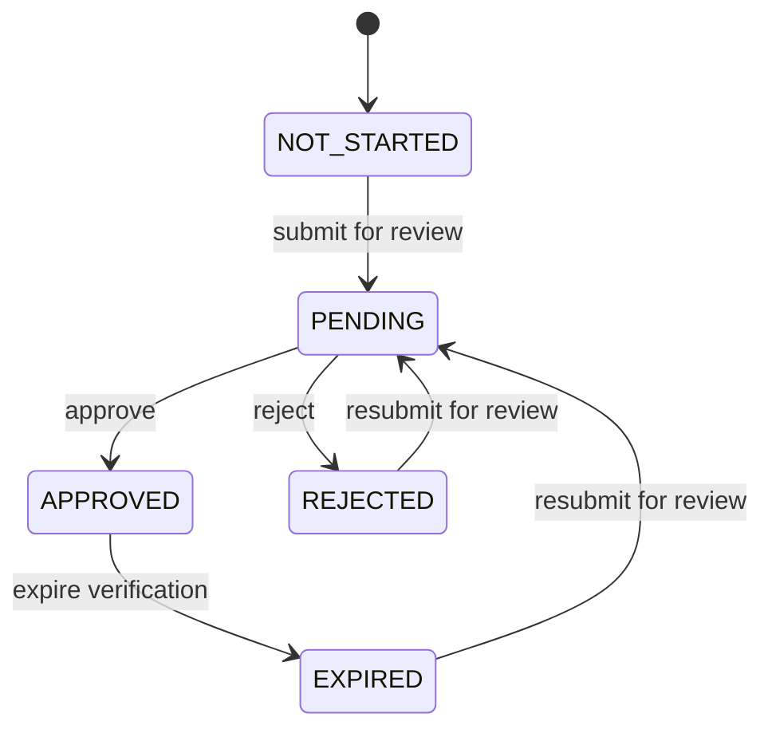
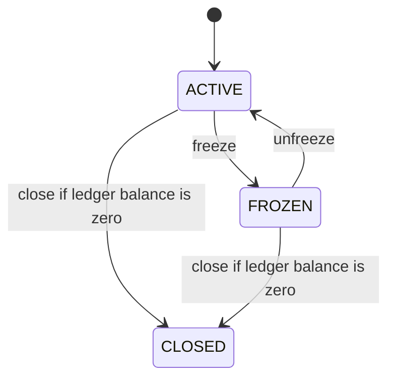

# KYC and Wallet State Diagrams

## KYC Review

Notes:

- `PENDING` is the stored enum value for pending review.
- `APPROVED` is the stored enum value for verified.
- SPRINT-09 implements submit, approve, and reject operations. Expiry is
  documented as an existing enum state, but no automated expiry workflow is
  introduced in this sprint.

## Wallet Lifecycle

Notes:

- `CLOSED` is terminal.
- Customer-initiated transfers require both wallets to be `ACTIVE`.
- Freeze, unfreeze, and close are operations-only actions, require a reason,
  and write audit and lifecycle history rows.
