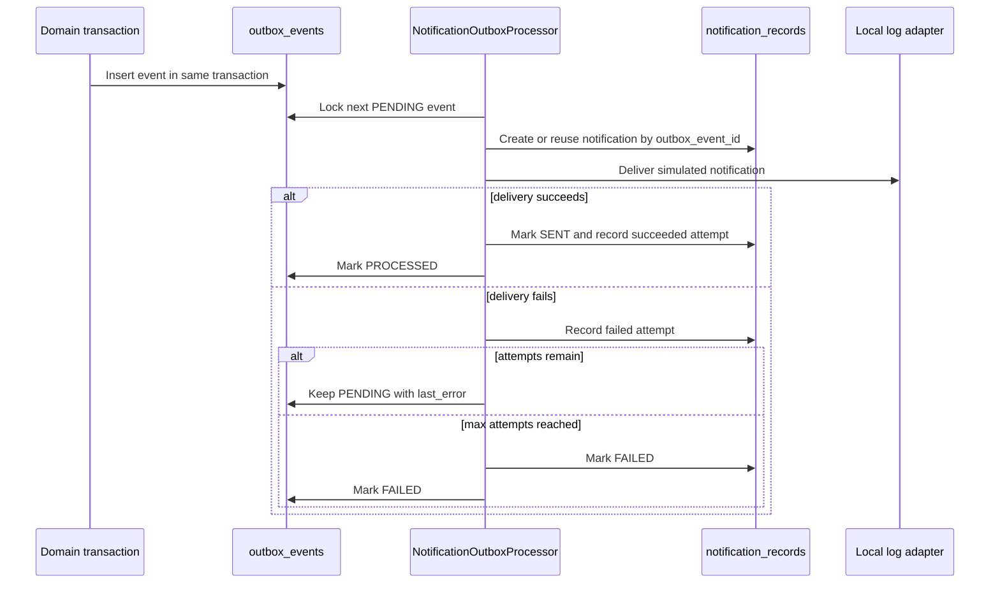

# Outbox Consumer and Notification Flow

SPRINT-18 turns selected transactional outbox rows into simulated local
notifications.

## Flow

## Selected Events

The notification processor maps these outbox event types:

- `INTERNAL_TRANSFER_COMPLETED`
- `PAYMENT_INTENT_AUTHORIZED`
- `PAYMENT_INTENT_CAPTURED`
- `PAYMENT_INTENT_REFUNDED`
- `KYC_APPROVED`
- `KYC_REJECTED`
- `WALLET_FROZEN`

Unsupported event types are marked processed without creating a notification.

## Reliability

`notification_records.outbox_event_id` is unique, so one domain outbox event
can create at most one notification record. Delivery retries append
`notification_delivery_attempts` rows and update only processing metadata.

The notification processor does not run inside the original money-moving
transaction. Failed notification delivery cannot create extra ledger journals,
holds, transfers, payments, or settlements.

## Content Rules

Notification content is generated from safe event categories and resource IDs.
It must not include bearer tokens, passwords, provider signatures, full raw
webhook payloads, or unnecessary PII. The current adapter is local-log only and
does not send email, SMS, or push notifications to real users.
