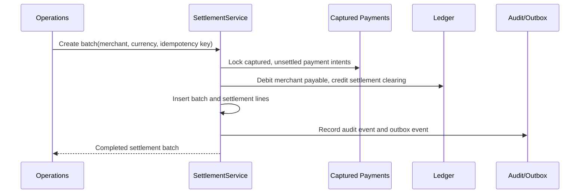
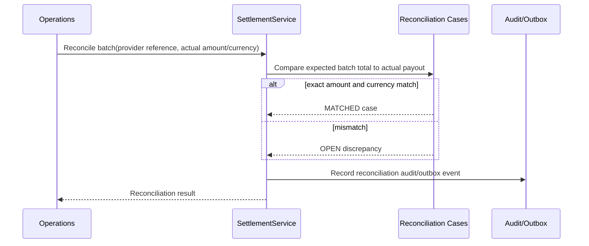

# Settlement and Reconciliation

SPRINT-15 moves captured merchant payable balances into settlement batches and
records simulated provider payout reconciliation.

## Settlement Flow

Only payment intents in `CAPTURED` status with a capture journal can be selected.
`settlement_lines.payment_intent_id` is unique, so the same capture cannot be
settled twice. Retrying the same merchant/idempotency key returns the existing
batch.

## Accounting

Captured payment already credited the merchant payable liability:

| Account | Debit | Credit |
|---|---:|---:|
| Customer wallet liability | amount |  |
| Merchant payable liability |  | amount |

Settlement moves the payable balance into the simulated settlement-clearing
account:

| Account | Debit | Credit |
|---|---:|---:|
| Merchant payable liability | amount |  |
| Settlement clearing asset |  | amount |

The settlement sprint does not integrate a real bank or payout provider. The
clearing account represents the simulated external settlement rail used for
portfolio workflows.

## Reconciliation Flow

Amount or currency mismatches create an `OPEN` reconciliation case with a stable
reason code such as `AMOUNT_MISMATCH` or `CURRENCY_MISMATCH`. Exact matches are
stored as `MATCHED` records to preserve a complete operational trail.
